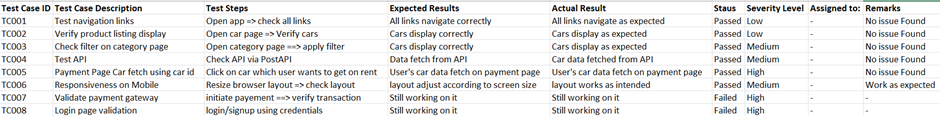

# Project Report: Hackathon 3 with functionality

This report summarizes the activities conducted over six days during the marketplace hackathon (3), detailing project development, deployment steps, and test case results.

## DAY 1: LAYING THE FOUNDATION FOR YOUR MARKETPLACE JOURNEY

### Activities:
- Defined marketplace types, business goal and it purpose
- Defined target audiences, services, USP
- Defined Data Schema b/c we are using [Sanity](https://www.sanity.io/docs) CMS as backend in this project

### Outcomes
Day 1 is all about understanding marketplace and laying a strong foundation for the rest of the hackathon. Today’s activities is about choosing marketplace type, defining business goals, and creating a data schema—are critical to aligning  technical implementation with real-world business needs. As progress through the hackathon, these initial steps will guide in building a functional, efficient, and
innovative marketplace.

## DAY 2 PLANNING THE TECHNICAL FOUNDATION

### Activities:
- Technical Plan Aligned with Business Goals: A comprehensive plan that reflects the unique requirements of their marketplace
- System Architecture Visualized: A clear diagram illustrating how the frontend interacts with Sanity CMS and third-party APIs.
- Sanity Schemas Drafted

### Outcomes
Day 2 is all about planning the technical foundation for marketplace, like elaborating that we'll used Nextjs for frontend, Sanity CMS as backend and used third party API for payment integration, showed interaction of system component using diagram, defining API endpoints, etc.

## DAY 3 - API INTEGRATION AND DATA MIGRATION

### Activities:
- Understand the Provided API
- Validate and Adjust Your Schema
- Data Migration from API to Sanity
- Fetch data from Sanity and show on frontend (Nextjs)

### Outcomes
-  Sanity CMS populated with imported data from external API
-  Functional API integration in Next.js displaying product listing, categories etc.

## DAY 4 - BUILDING DYNAMIC FRONTEND COMPONENTS FOR YOUR MARKETPLACE

### Activities:
- Built dynamic frontend components to display data from Sanity CMS
- Individual product detail pages implemented using dynamic routing
- Advanced category filters to refine and segment product views dynamically
- Components styled to ensure responsiveness and a professional look across devices.

### Outcomes
The project successfully integrated dynamic frontend components with Sanity CMS, enabling real-time data display and enhancing user experience. Individual product detail pages were implemented using dynamic routing, improving navigation and SEO. An advanced filtering system was developed to allow users to segment product views easily, increasing engagement and facilitating personalized discovery. Additionally, the application features a professional and responsive design across devices, ensuring a consistent user experience and visual appeal through effective cross-browser compatibility.

## DAY 5 - TESTING, ERROR HANDLING, AND BACKEND INTEGRATION REFINEMENT

### Activities:
- Did functional, error handling, performance optimization, cross-browser and device testing

### Outcomes
Ensured a robust and reliable car rental website by performing functional testing to verify core features, implementing error handling to enhance stability, optimizing performance for faster load times, and conducting thorough cross-browser and device testing to guarantee a seamless user experience across all platforms.

## DAY 6 - DEPLOYMENT PREPARATION AND STAGING ENVIRONMENT SETUP

### Activities:
- Selected Vercel as the hosting platform for its ease of use, Git integration, and performance optimization for frontend applications.
- Connected the project repository to Vercel for automatic builds and deployments.
- Configured environment variables securely using a .env file and Vercel's dashboard.
- Deployed the application to the staging environment after validating the build process.
- Conducted functional, performance, and security testing in the staging environment using tools like Lighthouse, GTMetrix, and manual testing.
- Documented test cases in a structured CSV format for tracking and reporting purposes.
- Updated documentation to capture deployment steps, test results, and preparation for final delivery.

### Outcomes
Successfully set up a reliable hosting platform with Vercel, enabling seamless deployment and updates through Git integration. The staging environment was thoroughly tested for functionality, performance, and security, ensuring HTTPS protection and optimal app performance. Comprehensive documentation and structured test case reporting ensured a well-organized deployment process, paving the way for a stable and efficient final product.

